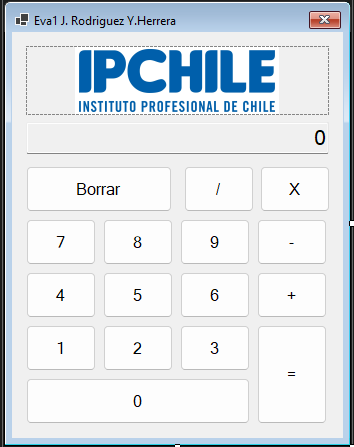

# 🧮 Calculadora Básica - Windows Forms (VB.NET)

  [](https://github.com/Jonaaxsic)

Este proyecto consiste en el desarrollo de una calculadora básica utilizando **Visual Studio** y **Windows Forms** en **VB.NET**. Forma parte de una actividad académica cuyo objetivo es aplicar conceptos de diseño de interfaz de usuario, manejo de eventos, estructuras de control de flujo y manipulación de datos.

---

## 📌 Características

- Interfaz gráfica intuitiva y fácil de usar.
- **TextBox** (`txtDisplay`) para mostrar números y resultados (solo lectura).
- Botones numéricos del **0 al 9**.
- Botones para operaciones aritméticas básicas:
  - ➕ Suma
  - ➖ Resta
  - ✖️ Multiplicación
  - ➗ División
- Botón **=** para calcular el resultado.
- Botón **C** para limpiar el TextBox y reiniciar la calculadora.
- Manejo de errores (ejemplo: división por cero).

---

## 🖼️ Captura de Pantalla




---

## ⚙️ Tecnologías Utilizadas

- **Lenguaje:** Visual Basic .NET
- **Entorno de desarrollo:** Visual Studio
- **Interfaz:** Windows Forms

---

## 🚀 Ejecución

1. Clonar el repositorio:
   ```bash
   git clone [https://github.com/jonaaxsic/tu-repo.git](https://github.com/jonaaxsic/tu-repo.git)
